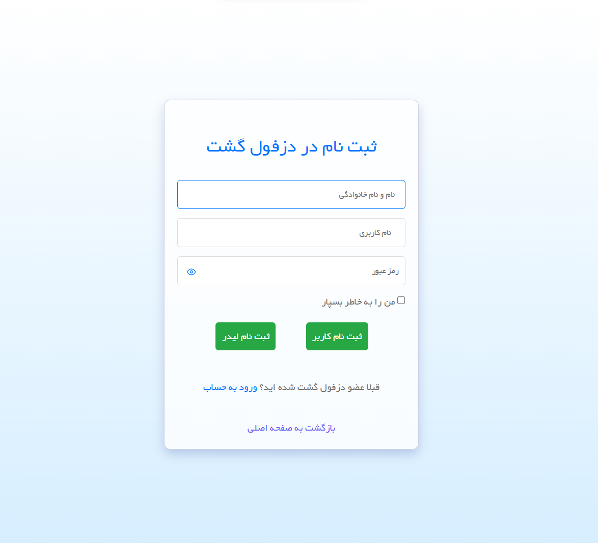
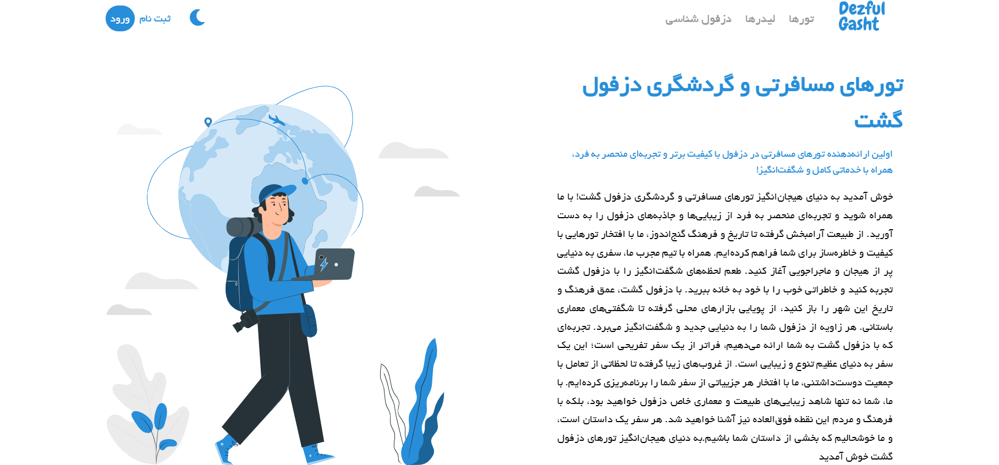
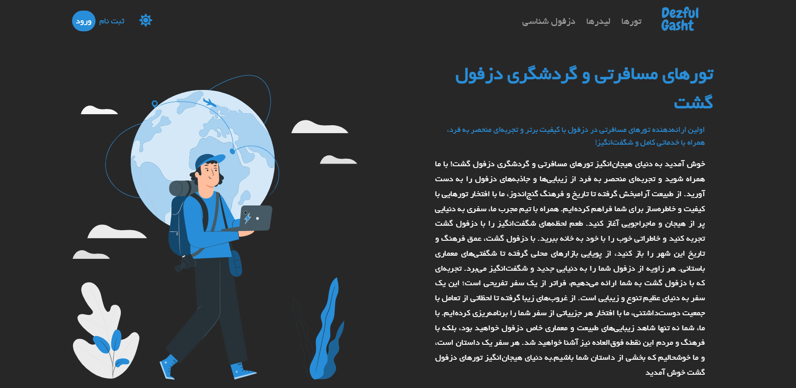
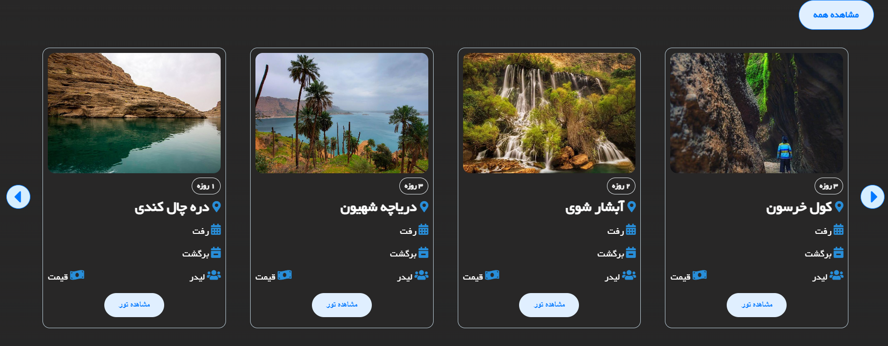
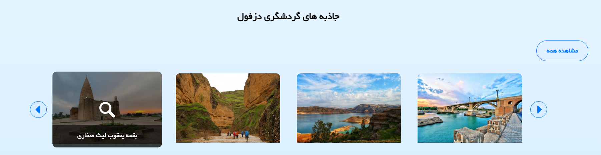
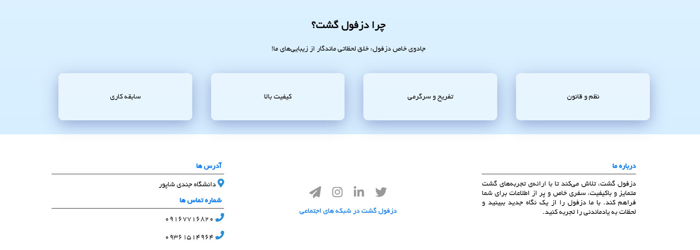

# 🌍 Dezful Gasht | دزفول گشت  

یک پروژه‌ی دانشگاهی برای معرفی تورهای مسافرتی و جاذبه‌های گردشگری دزفول  
## آذر 1402

---

## 🚀 معرفی پروژه  
دزفول گشت یک لندینگ پیج استاتیک برای نمایش تورهای مسافرتی، معرفی لیدرهای تور، و همچنین جاذبه‌های گردشگری دزفول است. این پروژه با استفاده از HTML، CSS و JavaScript توسعه داده شده و دارای قابلیت‌های زیر است:  

### ✨ ویژگی‌ها  
- 📌 نمایش اطلاعات تورهای گردشگری دزفول  
- 👤 معرفی لیدرهای تور همراه با بخش نظرات کاربران  
- 🏛 بخش "دزفول‌شناسی" برای نمایش جاذبه‌های گردشگری  
- 🌙 دارای تم دارک برای تجربه کاربری بهتر  
- 💬 بخش کامنت‌ها زیر پروفایل هر لیدر تور  
- 🎨 طراحی واکنش‌گرا (Responsive Design) برای نمایش در موبایل و دسکتاپ  

📌 نکته: این ریپازیتوری فقط شامل بخش استاتیک سایت است و بخش بک‌اند و پنل ادمین که با PHP توسعه داده شده، در اینجا قرار نگرفته است.  

---

## 🛠 تکنولوژی‌های استفاده‌شده  
- HTML5 → ساختار صفحات  
- CSS3 → استایل‌دهی و طراحی تم دارک  
- JavaScript → ایجاد تعاملات و قابلیت‌های داینامیک  
- FontAwesome → آیکون‌های گرافیکی  
- Google Fonts → فونت‌های بهینه برای رابط کاربری زیباتر  

---

## 📸 پیش‌نمایش صفحات  
### 🏕 صفحه اصلی | Home Page  
📌 نمایش اطلاعات کلی درباره‌ی تورها، لیدرها و جاذبه‌های گردشگری  

### 🎭 صفحه لیدرهای تور | Tour Leaders  
📌 لیست لیدرهای تور به همراه عکس، توضیحات و بخش نظرات کاربران  

### 🏛 صفحه دزفول‌شناسی | Dezful Attractions  
📌 نمایش مکان‌های دیدنی دزفول همراه با توضیحات و تصاویر  

- demo pic
---

---

